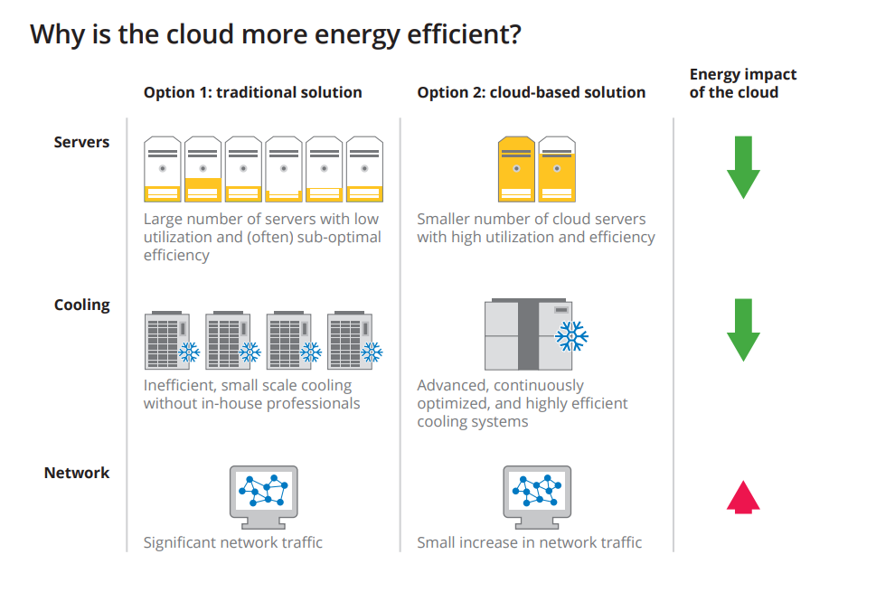
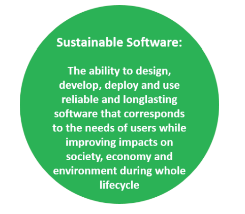
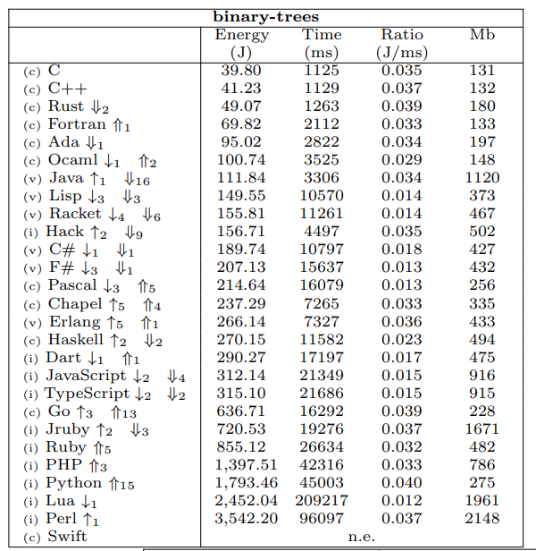

Sustainable Software/ Data Engineering:  
=======================
Sustainability is composed of five dimensions which are: individual, environmental, economic, technical and social sustainability.\
Sustainable SWE is an amalgamation of climate science, software engineering, electricity markets and data centre design.

### Eight principle (reference - https://principles.green/):
+ **Carbon**: Build applications that are carbon efficient.
+ **Electricity**: Build applications that are energy efficient.
+ **Carbon Intensity**: Consume electricity with the lowest carbon intensity.
+ **Embodied Carbon**: Build applications that are hardware efficient.
+ **Energy Proportionality**: Maximize the energy efficiency of hardware.
+ **Networking**: Reduce the amount of data and distance it must travel across the network.
+ **Demand Shaping**: Build carbon-aware applications.
+ **Measurement & Optimization**: Focus on step-by-step optimizations that increase the overall carbon efficiency.

## How can a sw/ data engineer support the sustainable SWE in cloud infrastructure
   
\
** reference diagram from google cloud
  

\ 
** source - (https://tel.archives-ouvertes.fr/tel-01724069/document)
   
+ Clean architecture for cloud services (microservices, data mesh, federated machine learning)
+ Stop resources if you do not need it
+ Endorse re-usability
+ write code that consumes less energy. ML - energy efficient algorithm with higher accuracy.
+ Application (code/ algorithm complexity) - time, space.\
  The Energy equation, Energy (J) = Power (W) x Time(s).\
  Power variable of the equation, which cannot be assumed as a constant, also has an impact on the energy.
   
\
** research paper (https://haslab.github.io/SAFER/scp21.pdf)
   
+ Use SaaS wherever possible - get help from existing provisioned infrastructure. Similar to a manual geared car.
  Starting a car from rest to motion is always expensive while the car is already in motion.
+ LoC - The minimum the better
+ Sustainability checks as a metrics should be part of sw/ data delivery  
+ Think of unnecessary data movement
+ Cheap (spot instance) clusters - low cost does not necessarily mean low energy consumption
+ When and where you run the application - generate less carbon footprint
+ Lightweight application

** Energy rating marked software could be a future for SW products.\
** Possibly a SW engineer could also get such ratings.

*** Petition: https://principles.green/